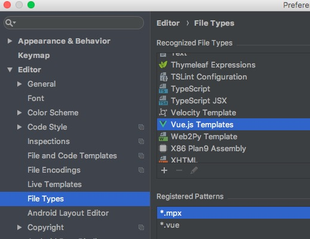
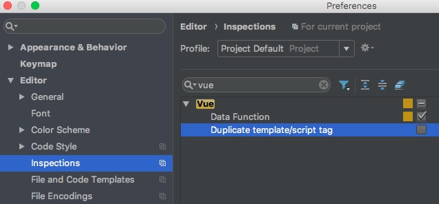

# IDE 高亮配置

- [IntelliJ](ide.md#IntelliJ)
- [vscode](ide.md#vscode)

## IntelliJ

如果使用 IntelliJ 系 IDE 开发，可将`.mpx`后缀文件关联到`vue`模板类型，按`vue`模板解析。



但会报一个`warning`提示有重复的`script`标签，关闭该警告即可。



## vscode

> [git地址](https://github.com/mpx-ecology/vscode-mpx)，有任何vscode插件的问题和需求可在仓库中提issue

> 下载

1. [下载地址](https://marketplace.visualstudio.com/items?itemName=pagnkelly.mpx)

2. 也可直接在vscode扩展处搜索mpx即可下载

> 使用

### 插件功能介绍

- 高亮
- emmet
- 跳转定义
- 自动补全
- eslint
- 格式化

[视频介绍](https://gift-static.hongyibo.com.cn/static/kfpub/3227/vscodes.mp4)


#### 高亮

&ensp;&ensp;与其他语言插件无异，提供相应代码的高亮，因为Mpx分为四个模块，所以每个模块都有相应的语法高亮，还包括注释快捷键，也区分了相应模块，比如`<template>`中使用的是html的高亮，且注释是`<!-- -->`,而`<script>`中就是`js`的高亮，注释是`//`


#### emmet

&ensp;&ensp;早在使用sublime时就在使用emmet插件，以提高写HTML的效率。

&ensp;&ensp;比如键入多个`<view>`标签：`view*n`。

&ensp;&ensp;比如一些标签的快速键入，配合`tab`或者`Enter`键快速键入

&ensp;&ensp;不仅仅是`<template>`模块，css，scss，less，stylus，sass模块也有相应的快捷指令


提示组件标签

我们可以像编写 html 一样，只要输入对应的单词就会出现对应的标签，比如输入的是 view ，然后按下 tab 键，即可输入 `<view></view>` 标签。


组件指令提示

指令的提示类似于 vue 文件一样，只要输入对应的指令前缀就会出现对应的完整指令，比如输入的是 wx ，然后按下 tab 键，就可以输入 wx:if="" 指令。


组件属性提示

微信小程序的每个组件都有一些属性选项，在编写组件的时候输入前缀就会出现完整的属性，并且包含了属性的说明和属性的类型。


组件事件提示

给组件绑定事件，也是只需要输入事件的前缀，就会出现完整的事件列表，然后按下 tab 键，即可输入 bindtap="" 类似的事件。


#### 跳转定义

&ensp;&ensp;command + 鼠标左键 查看定义位置，也可以在当前文件查看内容，决定是否跳转


#### 自动补全

&ensp;&ensp;毕竟Mpx是个小程序的框架，对于微信和支付宝的api快速补全snippets没有怎么能行，可在`<script>`中通过键入部分文字插入相应的代码块


#### eslint

&ensp;&ensp;eslint这块要分两部分来讲，一部分是插件实现了按照模块区分的简单的eslint，另一部分是要配合eslint的vscode插件，配置.eslintrc高阶的eslint检测。

部分一可通过配置开关

`<template>`是通过我们自己实现的eslint插件`eslint-plugin-mpx`，通过调eslint提供的引擎api，返回eslint校验的结果，我们再进行展示。

`<script>`中是通过调用typescript提供的检测js代码的api来进行检测，返回
的校验结果也是不太符合语法的，基础的检测，不会过于苛刻

`<style>`中会根据lang的设定进行相应的检测，此检测是vscode官方提供的库
`vscode-css-languageservice`

`<json>`模块同tempalte，用到了一个eslint插件`eslint-plugin-jsonc`来检测json的部分


部分二可参照此[链接](https://github.com/mpx-ecology/vscode-mpx/issues/35)配置

#### 代码格式化

支持代码格式化 JavaScript  (ts)· JSON · CSS (less/scss/stylus) · WXML，通过鼠标右键选择代码格式化文档。


默认每个区块都是调用 Prettier 这个库来完成格式化的，当然也可以在设置中切换成使用其他库。


如果切换成 none 将会禁用格式化。

Prettier 支持从项目根目录读取 .prettierrc 配置文件。配置选项可以参考 [官方](https://prettier.io/docs/en/configuration.html) 文档。.prettierrc 文件可以使用 JSON 语法编写，比如下面这样：

```
{
  "tabWidth": 4,
  "semi": false,
  "singleQuote": true
}
```

注意：由于 Prettier 这个库不支持格式化 stylus 语法，所以 stylus 的格式化使用另外一个 stylus-supremacy 库，配置 stylus 格式化规则只能在编辑器的 settings 中配置。
```
"mpx.format.defaultFormatterOptions": {
  "stylus-supremacy": {
    "insertColons": false, // 不使用括号
    "insertSemicolons": false, // 不使用冒号
    "insertBraces": false, // 不使用分号
    "insertNewLineAroundImports": true, // import之后插入空行
    "insertNewLineAroundBlocks": false // 每个块不添加空行
  }
}
```
总结一下，配置格式化有两种方式，一种是使用 .prettierrc 文件的形式配置，另一种是在编辑器的 settings 中自行配置，通过 mpx.format.defaultFormatterOptions 选项。
