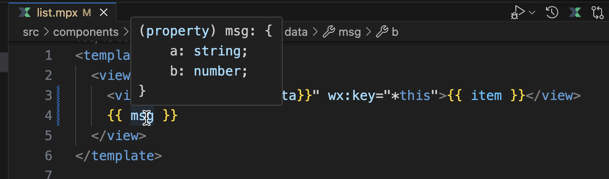

# IDE 支持

## VS Code

推荐使用的 IDE 是 [VS Code](https://code.visualstudio.com)，配合官方维护的新版本 [**Mpx (Official)**](https://marketplace.visualstudio.com/items?itemName=mpxjs.mpx-official) 插件。该插件提供了语法高亮、TypeScript 支持，以及模板内表达式与组件 props 的智能提示，提供更好的开发体验。

::: tip 注意
Mpx (Official) 现在取代了我们过去提供的插件 [mpx](https://marketplace.visualstudio.com/items?itemName=pagnkelly.mpx)、[mpx-template-features](https://marketplace.visualstudio.com/items?itemName=wangshun.mpx-template-features)。历史插件将不再维护逐步废弃，请大家及时切换到新版插件。更多历史背景及功能差异请参考[说明](https://github.com/mpx-ecology/language-tools?tab=readme-ov-file#why-new-extension)。
:::

Mpx (Official) 插件一大亮点功能是为 `<template>` 模板中的变量支持 TS 智能提示，包括类型提示、类型检查、自动补全、定义跳转等等功能。如下图所示：

有关更多插件详细功能介绍和使用说明，请参阅我们的[插件文档](https://github.com/mpx-ecology/language-tools/wiki)。

## Open VSX 插件生态 IDE

[Open VSX](https://open-vsx.org/) 是 Visual Studio Marketplace（VS Code 官方插件市场）的开源替代方案，可以为兼容 VS Code 的 IDE 提供插件市场支持。[Mpx (Official)](https://open-vsx.org/extension/mpxjs/mpx-official) 插件支持在 Open VSX 同步发版。

目前主流的 AI IDE 比如 [Cursor](https://cursor.com/cn)、[Trae](https://www.trae.cn)、[windsurf](https://windsurf.com/) 等等，基于都是 fork VS Code 开发，内部插件市场一般由 Open VSX 提供支持。如果您使用此类 IDE 或者其他支持 Open VSX 插件源的 IDE，可直接搜索安装 Mpx (Official)。

## IntelliJ

如果使用 IntelliJ 系 IDE 开发，可将 `.mpx` 后缀文件关联到 `vue` 模板类型，按 `vue` 模板解析。

但会报一个 `warning` 提示有重复的 `script` 标签，关闭该警告即可。

