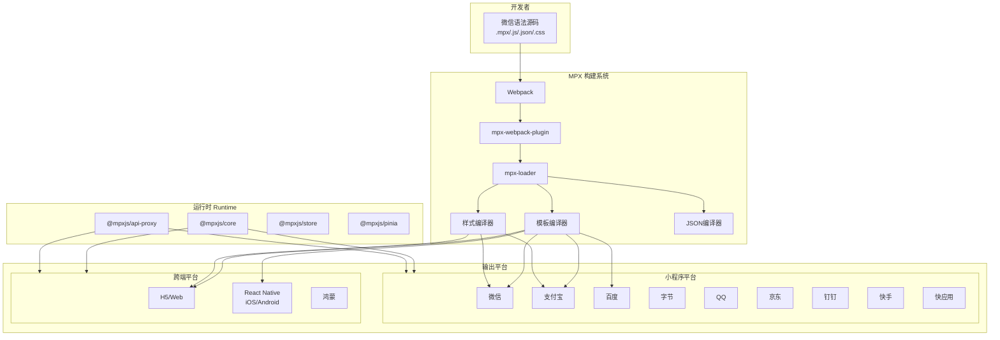
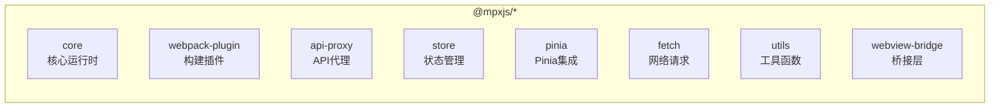
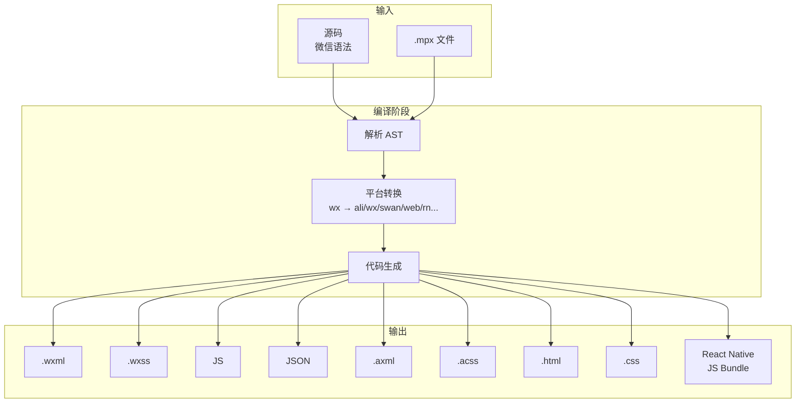
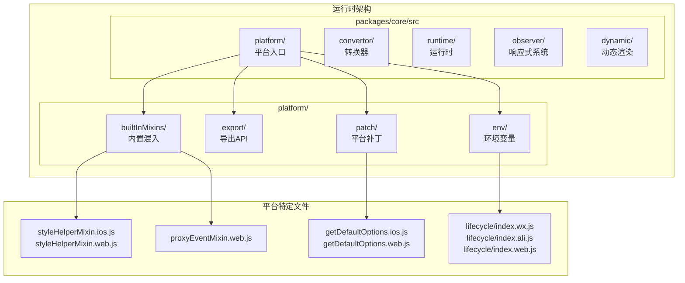
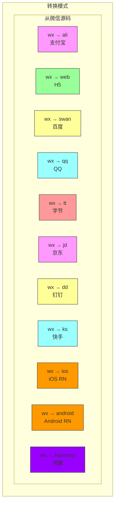
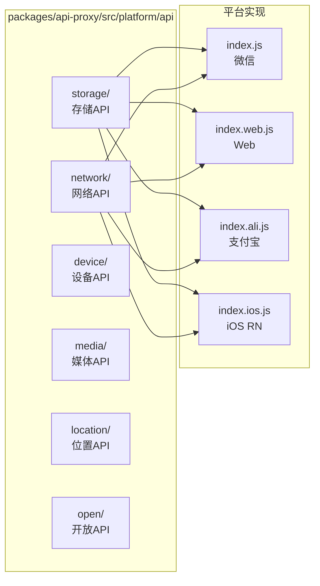

# MPX 跨端架构图

## 1. 整体架构图

## 2. 核心包架构

## 3. 构建转换流程

## 4. 运行时平台适配

## 5. 平台转换矩阵

## 6. API 代理架构

## 7. 关键文件位置

| 模块 | 路径 | 说明 |
|-----|------|-----|
| 核心入口 | `packages/core/src/index.js` | createApp/createPage/createComponent |
| Webpack插件 | `packages/webpack-plugin/lib/index.js` | 构建入口 (~90KB) |
| 平台配置 | `packages/webpack-plugin/lib/config.js` | 各平台配置 |
| 平台工具 | `packages/webpack-plugin/lib/utils/env.js` | 平台判断 |
| 转换模式 | `packages/core/src/convertor/getConvertMode.js` | 转换规则 |
| 运行时平台 | `packages/core/src/platform/index.js` | 平台入口 |
| 平台混入 | `packages/core/src/platform/builtInMixins/` | 运行时混入 |
| API代理 | `packages/api-proxy/src/index.js` | API入口 |

## 8. 支持的平台汇总

| 平台 | mode | 扩展名 | 关键文件 |
|-----|------|-------|---------|
| 微信 | wx | .wxml/.wxss | lifecycle/index.wx.js |
| 支付宝 | ali | .axml/.acss | lifecycle/index.ali.js |
| 百度 | swan | .swan/.css | lifecycle/index.swan.js |
| 字节 | tt | .ttml/.ttss | - |
| QQ | qq | .qml/.qss | - |
| 京东 | jd | .jxml/.jss | - |
| 钉钉 | dd | - | - |
| 快手 | ks | - | - |
| 快应用 | qa | - | - |
| H5 | web | .html/.css | lifecycle/index.web.js |
| iOS RN | ios | React Native | lifecycle/index.ios.js |
| Android RN | android | React Native | - |
| 鸿蒙 | harmony | - | - |
