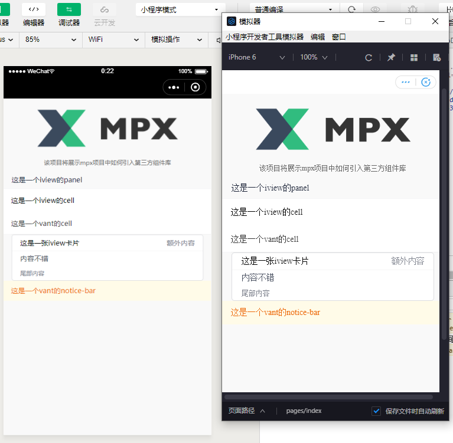

# MPX使用第三方组件库示例

> 不同于别的框架，***在第三方库的支持上，mpx做得非常完美***（和其他框架，甚至原生小程序里，如何使用第三方组件库，我们稍后会做一个对比给出）。

## 体验本项目

下载本项目到本地，`npm i` 安装依赖，`npm run watch:cross` 开始构建，然后用开发者工具打开本项目目录下生成的dist目录里对应平台的文件夹即可看到。

## 优势

- 路径简短
- 按需打包
- 跨平台

下面我们一条条看。

#### 路径简短

如 [此代码](./src/pages/index.mpx) 最下方引入组件部分，直接写包名，就会去node_modules下找对应的包。

#### 按需打包

上面的路径问题，好像用微信小程序自带的npm能力也可以做到？那看看这个能力吧，本示例混用了两个组件库里的六个组件，最终构建结果只会有这六个组件，**完全不用担心没有用到的组件也在您的项目中占用体积**。而vant按照微信小程序的npm标准提供的包，应该是会完全把整个组件库放进去，至于iview，可能是觉得这种机制不够好，直接没按微信小程序的npm标准提供那个字段。

#### 跨平台

目前支持跨平台的框架很多，那么要是组件库不能跨平台，岂不是还得自己封别的平台的组件库？mpx说：“不，我们帮你把第三方组件也跨一下”（有限支持，但提供了让用户搞定框架转不了的或者转得有问题的部分的能力）。

看个图吧：

左微信，右支付宝。
