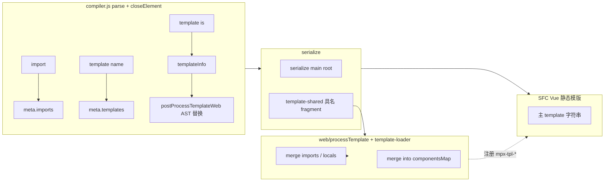

# 输出 Web 支持 template（静态 Vue 模版路线）

## 需求描述

微信小程序支持 template，详情可以查看：

- [模版定义与使用](https://developers.weixin.qq.com/miniprogram/dev/reference/wxml/template.html)
- [模版引用](https://developers.weixin.qq.com/miniprogram/dev/reference/wxml/import.html)

当前在输出 **Web**（`mode === 'web'`）时，不支持使用 template 特性，需要对其进行支持。在模版引用方面，与输出 RN 时**语义对齐**：仅支持 `import`，**不支持 `include`**。

## 设计原则：延续现有 Web 管线形态

**版本前提（当前工程）**：Web 侧与 **Vue 2.7** 对齐；业务依赖 **`vue@2.7.x`**（通常为 **`vue.runtime` 构建**）。与子模版 **构建期预编译** 相关的 **`vue-template-compiler`** 须与 **`vue` 同版本**（与 vue-loader 的硬性要求一致）。文中若单独提及「Vue 3」，均指 **未来主应用升级** 时的扩展分支，非当前默认路径。

当前 Web 输出路径为：`templateCompiler.parse` → **`templateCompiler.serialize(root)`** → 写入 SFC 的 **Vue 静态模版字符串**，由 vue-loader / Vue 编译器在构建期生成页面 render，**不**走小程序侧的 `global.currentInject.render` + `compiler.genNode` 式逻辑。

本方案在支持 `template` 时 **坚持同一形态**：

*   **编译期**：仍以 **序列化**为主，把「具名模版定义」「import 的 wxml」都变成 **Vue 可编译的模版片段或等价组件选项**（核心是 **字符串形态的 template**），避免为 Web 单独引入与 RN 同构的 **`gen-node-web` / 手写 `h` 树** 作为主路径。
*   **运行时**：**无新增运行时组件**，子模版以具名前缀（`mpx-tpl-<name>`）注册到宿主 `components`，由 Vue 原生静态/动态组件解析机制（`<component :is>`）直接驱动；不承担「把整页改成动态 render 函数」的职责。
*   **与「仅 Vue runtime」构建对齐**（详见 **§2.9**）：历史上 Web 侧使用 **`vue.runtime`** 即可，因 **SFC 主 `<template>`** 由 **vue-loader 在构建期**编成 `render`。若子模版组件选项仍带 **字符串 `template`** 且依赖 **运行时** `Vue.compile`，则只在「含编译器的完整 Vue」或开启运行时编译时可用；**目标**是在 webpack 管线内把具名片段 **预编译为 `render`**，保持与过往 **runtime-only** 部署一致。

与 RN 的差异仅在于 **载体**：RN 为 `createElement` 渲染函数；Web 为 **Vue 静态模版 + 既有构建链路**。**语义**（`meta`、data 合并规则、不预读 import 内建、wxs 等）仍与 [solutions/rn-template-support.md](./rn-template-support.md) 对齐。

## 与输出 RN 的特性对齐说明

| 能力 | 对齐要求（语义） | Web 产物形态 |
|------|------------------|--------------|
| `<import src="...">` | `meta.imports`，节点从树移除 | import 结果经 `web/template-loader` 合并进组件注册 / 模版表 |
| `<template name="...">` | 写入 `meta.templates`，不参与主树序列化 | 每个 name 对应一段 **serialize 得到的 Vue 模版字符串**（或带 `template` 字段的选项） |
| `<template is="..." data="...">` | `templateInfo` 与 RN 一致 | **`postProcessTemplateWeb`** 在 AST 上替换为 `<mpx-tpl-foo :mpx-data="..."/>` 或 `<component :is="…"/>`，再经 **`serialize`** 输出字符串 |
| 调用上下文 | 模版数据来自 `data`（**不暴露宿主 data**）；宿主 methods / components / wxs 可被继承 | `data` 通过 `:mpx-data` 传入子模版组件；宿主 methods / components / wxs 由 `provide/inject` + `created` 在子模版组件内运行期合入（见 §2.5 / §2.7） |
| 内建组件 | 不递归预读 import；各文件自己的内建映射 | import 模块导出时附带 **该 wxml 的 `builtInComponentsMap` / 局部 `components`**，与宿主 `componentsMap` 合并 |
| wxs | 与 RN 一致的 require 与 `wxsContentMap` | 不变，仍在 loader / `processTemplate` 中处理 |
| 引用方式 | 仅 `import` | 同左 |
| **宿主 slot（Web 增值）** | 小程序无 slot；RN 当前未与本节对齐 | **见 §2.8**：仅 **默认 / 具名**，**不支持** scoped slot。**`<template is>` 不传 slot**；slot 在**调用宿主**时传入，**`createTemplateComponent`** 内 **`$slots` → `__mpxHost.$slots`** getter 代理 |
| **仅 Vue runtime 兼容** | — | **见 §2.9**：子模版组件应以 **构建期 `render`**（而非运行时字符串 `template`）注入，与主 SFC、**`vue.runtime`** 用法一致；**方案已定，代码待按 §2.9 落地** |

## 实现方案

### 1. 总体设计

*   **compiler.js（与 RN 共用 AST）**  
    `processElement` 在 `isWeb(mode)` / `isReact(mode)` 下先执行 **`processTemplateTranspile(el, meta)`**（`import` → `meta.imports` 并移除节点；`<template name>` → `isTemplate` + `processingTemplate`；`<template is>` → `templateInfo`）。  
    **`closeElement`**：`isWeb(mode)` 为 `postProcessIf` → **`postProcessTemplateWeb(el, meta)`** → `postProcessRemove`；`isReact(mode)` 为 `postProcessForReact` / `postProcessIfReact` → **`postProcessTemplateReact(el, meta)`** → `postProcessRemove`。  
    - **`collectTranspileTemplateDefinition`**：`<template name>` 写入 **`meta.templates`** 后从主树 `removeNode`（Web / RN 共用）。  
    - **`postProcessTemplateWeb`**：先 `collectTranspileTemplateDefinition`；对仍带 **`templateInfo`** 的 `<template is>` 在 **AST 上 `replaceNode`** 为具名标签 **`${MPX_TEMPLATE_COMPONENT_PREFIX}<name>`** 或 **`<component :is="'…' + (is expr)">`**（前缀见 [const.js](packages/webpack-plugin/lib/utils/const.js) 中 **`MPX_TEMPLATE_COMPONENT_PREFIX`**），**不再在 `serialize` 里对 `template` 做特判**。

*   **主模版序列化**  
    对 `root` 调用 **`serialize`**：`<template is>` 已在 postProcess 中变为 `mpx-tpl-*` / `component` 节点，走通用元素序列化。

*   **具名片段（`<template name>` 内部 HTML）**  
    由 [template-shared.js](packages/webpack-plugin/lib/web/template-shared.js) 的 **`serializeWxTemplateDefinition`** 对 **`tplNode.children`** 逐个 `serialize` 拼接（**不含**外层 `<template>` 标签），供 `web/processTemplate` 与 `web/template-loader` 生成子组件 `template` 字段；组件注册名用 **`getWxTemplateComponentName`**（同上前缀常量）。

*   **web/processTemplate.js**  
    在 `return templateCompiler.serialize(root)` 之外：`require` 各 `import`（`!!web/template-loader!*.wxml`）；对本地 `meta.templates` 经 **template-shared** 得到片段字符串，与 import 合并为 **`wxTemplateComponentsInfo`** 供 `processScript`；**virtualHost 且 `ctorType === 'component'`** 时仍在 **本文件** 对 **根 `root`** 做多根校验（与具名 template 多根校验位置不同，见 §2.6）。

*   **web/template-loader.js**  
    解析独立 wxml，对每个 `meta.templates` 同样经 **template-shared** 序列化片段并生成子组件选项；导出 **`{ templateComponents, builtInComponentsMap }`**，不导出 RN 式 `(h, getComponent) => …`。



### 2. 详细实现

#### 2.1 `compiler.js`

*   **入口**：`processTemplateTranspile` 与 RN/Web 共用；**`postProcessTemplateReact`** 仅调用 **`collectTranspileTemplateDefinition`**；**`postProcessTemplateWeb`** 在收集定义之外，将 **`<template is>`** 替换为具名节点或 **`<component>`**（见 §1）。
*   **常量**：具名前缀 **`MPX_TEMPLATE_COMPONENT_PREFIX`**（`'mpx-tpl-'`）集中在 [const.js](packages/webpack-plugin/lib/utils/const.js)，compiler 与 web 侧共用，避免魔法字符串分叉。
*   template 子树内指令：以 **最终能 `serialize` 成合法 Vue 模版** 为准。

#### 2.2 主树序列化与具名片段

*   **主树**：`<template is>` 已在 **`postProcessTemplateWeb`** 中变为普通元素节点，**`serialize`** 无 `template + templateInfo` 特判；静态 `is` → `<mpx-tpl-foo …/>`，动态 `is` → `<component :is="…" …/>`（与 §1 表一致）。
*   **具名模版**：**不序列化**整颗 `<template name>` 节点；对 **`meta.templates[name]`** 仅序列化 **子节点拼接**（[template-shared.js](packages/webpack-plugin/lib/web/template-shared.js)），得到 **fragment 字符串**，由 §2.3 / §2.4 包成子组件选项。

**`:mpx-data` 绑定内容规范**

`mpx-data` 是一个**对象**，其 key/value 即传入该次模版调用的全部数据。构造规则（见 `processTemplateTranspile` 中对 `template` 的处理）：wx 的 `data="<raw>"` 被包成 `{<raw>}` 后交给 `parseMustacheWithContext` 解析，产物是一个在**宿主作用域**下求值的对象表达式，直接作为 `:mpx-data` 的 value（对应 Vue 的 `v-bind`）。具体映射：

| wx 写法 | `templateInfo.data` 表达式 | Vue 产物 |
|---------|-----------------------------|---------|
| `data="{{msg: 'hi'}}"` | `{msg: 'hi'}` | `:mpx-data="{msg: 'hi'}"` |
| `data="{{...item}}"` | `{...item}` | `:mpx-data="{...item}"` |
| `data="{{msg, ...rest}}"` | `{msg, ...rest}` | `:mpx-data="{msg, ...rest}"` |
| 省略 `data` | `''`（空串） | 不输出 `mpx-data` 绑定，子组件 `props.mpxData` 取 default `{}` |

子模版内的 `{{msg}}`、`{{onClickTap()}}`、`{{list}}` 等一切模版内可见的标识符，**都以 `mpxData` 为数据根**（方法/wxs 另见 §2.5 的方法代理方案）。`:mpx-data` 表达式在宿主作用域求值后即为一次性快照（对象引用）；宿主 data 变化会触发新快照重绑，由 Vue 响应式链路自动推进。

#### 2.3 `web/processTemplate.js`

*   解析后若存在 `meta.imports` / `meta.templates`：  
    *   生成对 `web/template-loader` 的 `require`；  
    *   对每个本地 name 使用 **`serializeWxTemplateDefinition`（template-shared）** 得到 **fragment**；  
    *   输出 **`wxTemplateComponentsInfo`**（imports + locals），供 `processScript` 合入宿主组件注册。  
*   **virtualHost 多根**：`hasVirtualHost && ctorType === 'component'` 时在本文件对 **`root`** 做「多于一个真实根子节点」报错（与具名 template 多根校验分离，见 §2.6）。  
*   **主输出仍为**：`genComponentTag` 包一层，**内容为 `serialize(root)` 的 Vue 静态模版字符串**。

#### 2.4 `web/template-loader.js` 与 `template-shared.js`

*   `parse` wxml，`mode: 'web'`。  
*   对每个模版名：经 **[template-shared.js](packages/webpack-plugin/lib/web/template-shared.js)** 将 **`<template name>` 内部** 序列化为 Vue 字符串，再包成子组件选项（`name` / `props.mpxData` / `template` / `components` 等）。  
*   导出：`{ templateComponents, builtInComponentsMap }`。  
*   **不**以「手写 render 函数」作为对外契约。

#### 2.5 模版子组件产物与作用域（`mpxData` + 运行时挂载）

> **作用域规则已敲定（#1）**：wx template 的数据**不与宿主 data 合并**——模版只能访问通过 `data="..."` 显式传入的数据（即 `mpxData`），**无法直接引用宿主 `data` 中的字段**。宿主的 **methods** 与 **components**（含内建）则**可被继承**，由 §2.7 的 `provide/inject + created` 桥接完成。wxs 同理以命名空间形式由宿主注入（详见 §2.7）。
>
> **核心难点**：Vue 静态模版中的 `{{ msg }}` 由 Vue 编译器绑定到 **该组件实例** 的 `this.msg`（实际执行路径为 `_vm.msg`，只在实例自身的 `props` / `data` / `computed` / `methods` 上查，**不查 `$attrs`**），而 RN `render` 函数可以在运行时通过 `Object.create(host)` 动态切换 `this`，二者实现形态不同，**RN 的 `fn.call(mergedContext, ...)` 做法无法照搬**。
>
> **为什么不用「按模版体标识符静态声明 props」**：理论上可以在 serialize 阶段扫描模版体，把 `msg`/`text`/`list` 等数据标识符集合提取出来声明为 prop——Vue 就能原生通过 `v-bind="item"` 展开成独立 prop 再由 `_vm.msg` 命中。但该方案要求在构建期做一次**作用域感知**的扫描（排除 `v-for` / `slot-scope` 局部变量、wxs 模块名、宿主方法名），实现复杂度高且与 mpx 现有识别链路耦合度大。本方案**显式拒绝**该路径，改用 §2.7 统一 `created` 钩子运行时挂载。

**构建期产物**：每个 `template name="foo"` 经 **template-shared** 得到内部 fragment 后，**作为一个子组件选项注册**，统一以 **`MPX_TEMPLATE_COMPONENT_PREFIX` + name** 为 Vue 组件名挂到宿主 `components` 字段。模版字符串**保持原样**，不做标识符改写：

```javascript
{
  name: 'mpx-tpl-foo',
  props: { mpxData: { type: Object, default: () => ({}) } },
  inject: { __mpxHost: { default: null } },
  template: '<view>...{{ msg }}...</view>',   // 保持原样，不改写
  components: { /* 该 wxml 文件的内建/局部组件 */ },
  created () { /* §2.7 统一钩子：方法/组件/wxs 桥接 + mpxData 挂载 */ }
}
```

**`<template is>` 的 serialize 产物**：

*   **静态 `is`**（`postProcessTemplateWeb` 中字面量匹配成功）→ AST 上变为具名标签 `<mpx-tpl-foo :mpx-data="item" />`，再经 `serialize` 输出。
*   **动态 `is`**（如 `<template is="{{cond ? 'a' : 'b'}}" />`）→ AST 上变为 `<component :is="'mpx-tpl-' + (cond ? 'a' : 'b')" :mpx-data="item" />`，由 Vue 按 `components` 解析。

> 两条路径都由 Vue 原生机制承担，**不需要额外的 `mpx-wx-template` 占位组件 / `resolveTemplate` helper**。未命中（动态 name 未匹配任何已注册模版）时依赖 Vue 自身的空渲染 + 开发期 warn；如需自定义兜底（日志、占位 UI）可后续按需再加一层。嵌套 `<template is>` 在 serialize 时递归按此规则处理。

**数据挂载策略：`created` 钩子 `defineReactive`**

在子模版组件的 `created` 钩子里对 `mpxData` 的每个 key 调用 `Vue.util.defineReactive(this, k, v)`，让 Vue 模版编译出的 `_vm.x` 读取路径直接命中实例。`mpxData` 后续变化由 `$watch` 补写/刷新。

*   方法/组件/wxs 桥与数据挂载**共用同一个 `created` 钩子**，完整代码见 §2.7。
*   为什么能在 `created` 生效：Vue 2 的 `_init` 时序为 `beforeCreate` → `initInjections`（`__mpxHost` 可用）→ `initState` → `created` → `$mount` → 首次 render（`_vm.x` 查找）。`created` 里挂上去的响应式 key 在首次 render 前就位。

**已知风险 / 落地注意**：

*   **依赖 `Vue.util.defineReactive`**：Vue 2 半官方入口，Vue 3 迁移时需改为 `reactive` / `effect` 语义；
*   **开发期 warn 噪音**：模版编译期 Vue 会对 `_vm.x` 的未声明标识符路径发出「Property or method is not defined」warn（生产构建不致命）。可以接受 warn，或通过子组件 `data()` 返回空对象兜底抑制——**本方案默认接受**，避免过度工程化；
*   **静态分析不兼容**：Vue 模版静态分析工具无法追踪 `msg` 在构建期的声明来源——属本方案内在限制；
*   **POC 验证**：实施 PR 前用最小用例集（纯数据引用、方法调用、`v-for` 局部变量、wxs 模块、嵌套 template、import 跨文件、`mpxData` 引用变更）跑通一遍，确认 `_vm.x` 能正常命中 `created` 中定义的响应式属性 getter。

#### 2.6 子模版内建、嵌套与多根限制

*   **独立内建**：每个 wxml 的 loader 产物携带 **本文件** `builtInComponentsMap`，在注入宿主 option 时与页面级 map **合并**（命名冲突需按微信 template 规则定义优先级，建议在实现章节写明）。  
*   **嵌套**：子模版内的 `<template is>` 在同一套 **`postProcessTemplateWeb`** 规则下被替换为 `<mpx-tpl-*>` 或 `<component :is="…">`，**不**引入 RN 式 `getComponent` 参数链（若后续与子 wxml 内建合并冲突，再在 **组件注册维度** 细化）。
*   **多根限制（#4 决策）**：Vue 2.7 子组件必须单根（Fragment 仅在 Vue 3 原生支持）。当前实现分两处：
    *   **`<template name>` 定义体多根**：在 **[template-shared.js](packages/webpack-plugin/lib/web/template-shared.js)** 的 **`serializeWxTemplateDefinition`** 中，若「非 `temp-node` 的元素子节点」多于 1，则 **`emitError`**（英文提示），**`web/template-loader` 与 `processTemplate` 共用**。
    *   **宿主组件根多根 + virtualHost**：在 **`web/processTemplate.js`** 中，当 **`hasVirtualHost && ctorType === 'component'`** 且 **`root`** 下真实根子节点多于 1 时报错（英文提示）。  
    *   **说明**：`compiler.parse` 末尾仍保留历史上注释掉的 **`temp-node` 根多根**示例代码（未启用）；根级与具名 template 的多根策略未合并为单一函数，以避免与现有 RN 共用 parse 流程强耦合。
    *   后续若要支持多根，可考虑自动外包根包裹节点，但会影响选择器，**本期不做**。

#### 2.7 宿主能力共享（方法 / 组件 / wxs）

wx 原生 template 的语义要求：模版在作用域上与宿主共享 **方法**（`{{handler()}}`、`bindtap="handler"`）、**已注册的组件**（`usingComponents`、内建组件）与 **wxs 模块**——但**不包含 data**（#1 决策，详见 §2.5）。本节的方法/组件/wxs 桥与 §2.5 的 `mpxData` 数据挂载**共用同一个 `created` 钩子**，避免多钩子间的时序耦合。

**桥接入口：provide / inject**

宿主组件（由 `processComponentOption` 链路注入的 mpx 组件基类）在 `provide` 中暴露 `__mpxHost: this`，所有 `mpx-tpl-*` 子模版组件通过 `inject: { __mpxHost: { default: null } }` 拿到宿主实例引用，用于后续的方法代理、组件合并、wxs 透传。

*   **为什么是 `created` 而非 `beforeCreate`**：Vue 2 生命周期时序为 `beforeCreate` → `initInjections` → `initState` → `created`，`this.__mpxHost` 在 inject 初始化后才可用。
*   **为什么要在首次 render 前完成**：避免 Vue dev mode 对未声明标识符的 warn；`created` 早于 `$mount` 与首次 render，时序充分。
*   **为什么不用 `this.$parent`**：嵌套 `<mpx-tpl-A><mpx-tpl-B/></mpx-tpl-A>` 时 `B.$parent === A`（中间模版层），而 `__mpxHost` 始终指向最外层真实宿主；wx 语义下模版方法/组件应来自真实宿主而非中间模版层。

**统一 `created` 示例（含 §2.5 的 `mpxData` 运行时挂载）**

```javascript
inject: { __mpxHost: { default: null } },
created () {
  const host = this.__mpxHost
  if (!host) return

  // 1. 方法代理：把宿主 methods 以 bind(host) 挂到 this
  const hostMethods = host.$options.methods || {}
  Object.keys(hostMethods).forEach(k => {
    if (!(k in this)) this[k] = hostMethods[k].bind(host)
  })

  // 2. wxs 模块透传：按 host 上暴露的命名空间（如 host.$wxsModules）按 key 挂到 this
  const wxsModules = host.$wxsModules || {}
  Object.keys(wxsModules).forEach(k => {
    if (!(k in this)) this[k] = wxsModules[k]
  })

  // 3. components 合并：实例级副本，不污染共享选项；保留原型链（全局组件挂在原型上）
  const base = this.$options.components || {}
  const merged = Object.create(Object.getPrototypeOf(base))
  Object.assign(merged, base, host.$options.components || {})
  this.$options.components = merged

  // 4. §2.5 的 mpxData 挂载（放在最后，保证 data 覆盖同名方法/wxs，符合 wx 语义）
  const mpxData = this.mpxData || {}
  Object.keys(mpxData).forEach(k => {
    Vue.util.defineReactive(this, k, mpxData[k])
  })
  this.$watch('mpxData', (next) => {
    Object.keys(next || {}).forEach(k => {
      if (k in this) this[k] = next[k]
      else Vue.util.defineReactive(this, k, next[k])
    })
  })
}
```

*   **执行顺序要点**：方法 → wxs → components → data。data 放最后，保证 `mpxData` 的 key 可以覆盖同名的方法/wxs，与 wx `data` 优先的语义一致。
*   **组件合并（`$options.components`）**：Vue 的组件解析（render 期的 `resolveAsset`）只查 `this.$options.components` + 全局注册，**不沿 `$parent` 或 inject 链向上查找**。因此光通过 `inject` 拿到宿主 `this` 不够——必须把宿主 `components` 合并到子模版组件**自己**的 `$options.components`。`$options` 是实例级的，可在 `created` 钩子中动态合并。
*   **不需要构建期侵入 `processComponentOption`**：原来需要为每个宿主浅克隆一份 `mpx-tpl-*` 选项的思路被简化掉，注册链路保持不变，仅子模版组件自身负责。
*   **冲突优先级**：`host.$options.components`（宿主级）覆盖 `base`（文件级 / template-loader 内建），与 wx "宿主优先" 的语义一致。
*   **嵌套与动态 `is`**：嵌套 `<mpx-tpl-A><mpx-tpl-B/></mpx-tpl-A>` 时 B 通过 inject 拿到的仍是最外层宿主（A、B 都不再 provide 覆盖），B 的 `components` 同样合入宿主的全集，`mpx-tpl-*` 之间互相可见；`<component :is="'mpx-tpl-' + name" />` 由 Vue 原生按字符串查 `$options.components`，同样命中。
*   **循环引用**：A 用 B、B 用 A 均为运行期惰性解析，合并后自动支持。

#### 2.8 Web 模版内使用宿主组件的 slot

> 在坚持「serialize + 静态 Vue 模版 + `mpx-tpl-*` 子组件」前提下，让具名 wx 模版片段内的 **`<slot>`** 能展示**宿主在被外层调用时**传入的默认 / 具名插槽内容。
>
> **运行时**：已在 [optionProcessor.js](packages/webpack-plugin/lib/runtime/optionProcessor.js) 的 **`createTemplateComponent`** 中通过 **`installMpxWxTemplateHostSlotsProxy`**（`created` 内对实例 **`$slots` 的 getter** 转发至 `__mpxHost.$slots`）落地。**编译期**具名片段内 `<slot>` 仍依赖既有 **serialize**（若遇平台规则误伤再单独白名单）。
>
> **能力范围**：只支持 Vue 2 语义下的 **默认 slot** 与 **具名 slot**。**不在范围内**：**scoped slot**（`slot-scope`、`v-slot` 带参数、`$scopedSlots` 等）。

##### 2.8.1 决策：`template is` 不传 slot

*   **`<template is="…" data="…">` 不向子模版传递 slot 内容**（与小程序一致：无子节点语义），**compiler 侧保持** `postProcessTemplateWeb` 输出的 **自闭合** `<mpx-tpl-* />` / `<component :is="…" />`，**不**扩展为带子节点的非自闭合标签。
*   **slot 的来源**：使用方在 **调用宿主页面/组件**（外层 Vue 父）时，按常规写法把子节点挂在**宿主根**上并打上 `slot` / `slot="name"`；即 slot VNode 挂在 **宿主实例**的 `$slots` 上，而不是挂在 `<template is>` 或 `mpx-tpl-*` 调用点上。

##### 2.8.2 推荐实现：`__mpxHost` 透传并覆盖到模版子组件

与 §2.7 已采用的 **`inject: { __mpxHost }`** 一致：子模版组件通过 **`inject` 拿到宿主后**，对 **`$slots`（或各具名槽位）采用 getter 代理**——读取时转发到 **`this.__mpxHost.$slots`**（仅 `default` 与具名 key，**不**使用 `$scopedSlots`），使片段内 `<slot>` / `<slot name="…">` 解析到的始终是**宿主当前**的插槽 VNode，**无需**在 `created` 里拷贝一份再靠 **`$watch`** 追赶更新。

*   **语义**：模版片段里的 `<slot name="header">` 与宿主根上「父组件传给宿主、且 `slot="header"`」的内容对齐；**默认槽**同理对应 `default`。
*   **与 `mpxData` 的关系**：数据仍以 `:mpx-data` 为准；slot 为 **结构/VNode** 通道，二者正交。若同名冲突，在方案落地时单列优先级（建议 **slot 占位与 mpxData 字段分离**，避免同名 key）。
*   **实现（已落地）**：见 **`installMpxWxTemplateHostSlotsProxy`**（`Object.defineProperty(this, '$slots', { configurable: true, get () { … } })`，在 **`createTemplateComponent` → `created`** 中、`inject` 就绪后调用）。若需同时保留子组件自身子节点对应的 slot，可后续在 **getter** 内对 **`__mpxHost.$slots`** 与 **本地 `$slots`** 做 **按 key 合并**。若 **`$slots` 不可被覆盖**，开发环境 **`console.warn`** 后回退，仍可按 §2.8.2 末条采用代理对象或 render 合并等方案。

##### 2.8.3 编译与序列化侧（P0）

*   **具名 `<template name>` 内部**允许出现 **`<slot>` / `<slot name="…">`**，经 **serialize** 进入子组件 `template` 字符串；**processingTemplate** 路径下不误删、不误改（平台规则若有误伤需白名单）。
*   **无需**为 slot 改动 `<template is>` 的 AST 形态。

##### 2.8.4 与 RN 对齐策略

*   RN 侧若暂无同一 slot 能力，Web 在 §1 特性表单独标注即可；语义上仍以 **小程序 `data`** 为主，slot 为 **Web 增值**，不强制 RN 同期实现。

##### 2.8.5 风险与待决策

*   **Vue 2.7**：仅默认 / 具名；**不支持** scoped slot。宿主 **`$slots` 随异步子、v-if 等变化**时，由已实现之 **getter** 每次读取最新引用；**不建议**用 **`$watch`** 同步拷贝。若 **`defineProperty` 失败**（见 §2.8.2 末条回退），再评估 mixin / render 兜底。
*   **动态 `<component :is="…">`** 选用子模版时，`$slots` 透传逻辑须与静态 `mpx-tpl-*` 一致。
*   **virtualHost / 多根**：与 §2.6 的交互在实现阶段复测。

#### 2.9 与「仅 Vue runtime」构建兼容（技术方案）

**基线**：本节实现与验证均以 **Vue 2.7 + `vue-template-compiler@2.7.x`** 为准（与 §「设计原则」版本前提一致）。

##### 2.9.1 问题

*   Vue 发布产物分为 **完整版（含模板编译器）** 与 **runtime-only**（不含 `compiler`）。组件选项中的 **`template: '<div>...</div>'` 字符串** 仅在下列情况下可被 Vue 消费为真实渲染逻辑：
    *   使用 **完整版 Vue**，在运行期对 `template` 做编译；或
    *   使用 **`Vue.compile`**（同样依赖打包进应用的编译器代码）。
*   **runtime-only** 构建下，子组件若只提供 **字符串 `template`** 而无 **`render`**，模板**不会**被编译，表现为空白或开发环境告警——这与 **mpx Web 长期约定**（业务只依赖 **`vue.runtime`** + 构建期编译）不一致。
*   **主 `.mpx` 页面/组件**无此问题：主 `<template>` 经 **vue-loader**（或等价链路）在 **webpack 构建期**已变为 **`render` 函数**，不依赖运行时编译。
*   **当前缺口**：**`createTemplateComponent({ template: fragmentString, ... })`**（见 [template-loader.js](packages/webpack-plugin/lib/web/template-loader.js)、[processScript.js](packages/webpack-plugin/lib/web/processScript.js) 生成的 `JSON.stringify(local.template)`）把 **serialize 得到的 HTML 字符串**原样塞进组件选项的 **`template` 字段**，等价于要求运行环境具备 **模板编译能力**；在 **仅 runtime** 的 Vue 上无法与主 SFC 行为对齐。

##### 2.9.2 目标

*   **Wx 具名模版**对应的子组件选项，与宿主 SFC 一致：**在 webpack 构建期**用 **`vue-template-compiler`** 完成模板 → `render` 的转换；**运行期**应用包只依赖 **`vue.runtime`**（`h` / `_c` / `createElement` 等），**不**在浏览器里打包 **编译器**或完整 Vue。
*   **不改变** RN 侧与 **compiler.serialize** 的语义；仅 **Web 产物形态**从「字符串 `template`」演进为「**可执行的 `render`（及 Vue 2.7 下必要时 `staticRenderFns`）**」。

##### 2.9.3 推荐实现路径

| 步骤 | 内容 |
|------|------|
| **1. 编译入口** | 在 **`web/template-loader.js`** 与 **`web/processScript.js`** 中，在拼接 **`createTemplateComponent({...})`** 之前，对 **`serializeWxTemplateDefinition` 得到的 fragment 字符串**调用 **`vue-template-compiler@2.7.x`** 的 **`compile`**（与 **`vue@2.7.x`** 同版本），得到 **`render` 函数字符串**及所需的 **`staticRenderFns`**。若未来主应用升级为 **Vue 3**，再改用 **`@vue/compiler-dom`**（或 `@vue/compiler-sfc`）等 API，与主版本分支对齐。 |
| **2. 代码生成** | 生成模块代码时，将子组件选项从 **`template: ${JSON.stringify(tpl)}`** 改为 **`render: ${compiled.render}`**（对 `compile` 返回的 `render` 作 **`new Function` 安全包装**或 **直接内联为可被 webpack 解析的函数字面量**，具体以与现有 **vue-loader** 产物风格一致为准）；Vue 2.7 若编译结果含 **`staticRenderFns`**，按 Vue 2 组件选项惯例挂到 **`staticRenderFns`** 并在 `beforeCreate`/`created` 中与运行时约定对齐（与 vue-loader 生成物对齐）。 |
| **3. 复用与缓存** | 抽象 **`compileWxTemplateFragment(fragment, { resourcePath, name })`**，两处（独立 wxml loader 与 .mpx 内联 locals）共用；**resourcePath + template name** 用于错误栈与缓存 key，避免同内容不同文件混淆。 |
| **4. 版本与 peer** | **`vue-template-compiler` 与 `vue` 须同版本**（当前 **2.7.x**）；在 **package.json / peerDependencies** 中声明，与主项目 vue-loader 一致，避免「编译器与运行时 patch/minor 不一致」的已知问题。 |
| **5. 不采纳** | 全局改为引入 **完整 Vue**；或在业务里对子模版 **`Vue.compile(fragment)`** 运行时编译（体积、CSP、与 tree-shaking 目标冲突）。 |

##### 2.9.4 边界与风险

*   **Scoped CSS**：具名片段通常 **无** 独立 `<style>`，与主 SFC **scopeId** 的关系需在实现时约定（多数情况下仅结构 DOM，无 scoped 需求；若有，需额外设计 **scopeId 注入**，本期可列为后续）。
*   **编译报错**：应带 **wxml 路径**、**template name**，与现有 loader **emitError** 风格一致。
*   **Vue 3**：编译 API 与选项形态与 Vue 2 不同，需单独分支，与主应用 Vue 主版本对齐。

##### 2.9.5 状态

*   本文为 **技术方案**；落地后应在 **template-loader / processScript** 产物中 **以 `render` 为主** 验证 **仅 `vue.runtime`** 场景，并补充 **构建期** 单测或快照（生成代码片段含 `render`、不含裸 `template: \"<...\"` 依赖运行时编译）。

### 3. 代码示例

**输入**（与 RN 文档相同）：

```xml
<import src="./item.wxml" />
<template name="msgItem">
  <view>
    <text> {{index}}: {{msg}} </text>
    <text> Time: {{time}} </text>
  </view>
</template>

<template is="msgItem" data="{{...item}}"/>
<template is="item" data="{{...item}}"/>
```

**输出结构示意**

*Part A — SFC 主 `<template>`（仍为静态 Vue 模版，全部用具名子组件标签，静态 name 直接写标签）*：

```html
<mpx-tpl-msgItem :mpx-data="item" />
<mpx-tpl-item :mpx-data="item" />
```

> 若 `is` 为动态表达式（如 `<template is="{{x ? 'a' : 'b'}}"/>`），则输出 `<component :is="'mpx-tpl-' + (x ? 'a' : 'b')" :mpx-data="item"/>`。

*Part B — 编译期生成的具名片段（模版字符串保持原样，`mpxData` 的 key 由 `created` 钩子 `defineReactive` 到实例）*：

```html
<view class="...">
  <text>{{ index }}: {{ msg }}</text>
  <text> Time: {{ time }}</text>
</view>
```

*Part C — 脚本注入（示意：子模版组件合并进宿主 `componentsMap`，走现有 `processComponentOption` 注册链路）*：

```javascript
// import 的 wxml 经 web/template-loader：导出 templateComponents + builtInComponentsMap
var imported = require('!!.../web/template-loader!./item.wxml')
// processScript 在构造 componentsMap 时：
//   Object.assign(componentsMap,
//     imported.templateComponents,          // { 'mpx-tpl-item': { render, props, components, ... } }  （§2.9 落地后宜为 render，而非字符串 template）
//     localTemplateComponents               // { 'mpx-tpl-msgItem': { ... } }
//   )
// 由 processComponentOption 注册到 option.components；SFC 主模版里的 <mpx-tpl-*> 由 Vue 原生解析。
```

### 4. 实现清单

| 文件 | 说明 |
|------|------|
| `packages/webpack-plugin/lib/template-compiler/compiler.js` | `processTemplateTranspile`；`postProcessTemplateWeb` / `postProcessTemplateReact` + `collectTranspileTemplateDefinition`；**`<template is>` 在 AST 替换**；通用 `serialize` |
| `packages/webpack-plugin/lib/utils/const.js` | **`MPX_TEMPLATE_COMPONENT_PREFIX`**（`'mpx-tpl-'`） |
| `packages/webpack-plugin/lib/web/template-shared.js` | **`serializeWxTemplateDefinition` / `getWxTemplateComponentName`**：具名模版 **内部 fragment** 序列化 + 定义体多根校验 |
| `packages/webpack-plugin/lib/web/processTemplate.js` | `serialize(root)`；**virtualHost 根多根**校验；**template-shared** 生成本地 locals；输出 **`wxTemplateComponentsInfo`** |
| `packages/webpack-plugin/lib/web/template-loader.js` | wxml → **`template-shared`** → `{ templateComponents, builtInComponentsMap }`；**§2.9**：对 fragment **构建期 `compile` → `render`** 再注入 `createTemplateComponent` |
| `packages/webpack-plugin/lib/web/processScript.js` | 合并具名子模版进 `componentsMap`，由 `processComponentOption` 注册；**§2.9**：本地 `locals` 同样 **预编译为 `render`** |
| `packages/webpack-plugin/lib/runtime/optionProcessor.js` | **`createTemplateComponent`**：`provide` 宿主、`installMpxWxTemplateHostSlotsProxy`（**`$slots` → `__mpxHost.$slots`**）等 |
| 测试 | 断言主模版 **serialize** 含 `<mpx-tpl-*>` / `<component :is>`；loader / 主文件产物为 **子组件选项映射**（与 RN 的 `createElement` 风格区分）；**`test/runtime/create-template-component.spec.js`** 覆盖 slot 代理 |
| **宿主 slot** | **§2.8**：`createTemplateComponent` 已安装 **`$slots` getter**；**不**扩展 `<template is>` 子节点；可选补充 E2E |
| **仅 runtime Vue（§2.9）** | **template-loader / processScript** 产物由 **`template` 字符串** 升级为 **构建期 `render`**；与 **`vue.runtime`** 对齐 |

### 5. 与前一版方案的关系

*   **不引入**（注意：当前仓库中 `gen-node-web.js` 并不存在，历史讨论曾建议「web 照搬 RN 函数式产物」即新增 `gen-node-web`，本方案**明确拒绝**该路径，以避免 Web 出现与 Vue 静态模版脱节的第二套渲染主干）：`gen-node-web.js`、以 `getTemplate(...).call(..., h, getComponent)` 为主干的 Web 聚合方式。  
*   **保留**：与 RN 一致的 **meta 与语义**、**不递归预读 import 内建**、**wxs**、**仅 import**。  
*   **RN 仍使用** [gen-node-react.js](packages/webpack-plugin/lib/template-compiler/gen-node-react.js) + [react/processTemplate.js](packages/webpack-plugin/lib/react/processTemplate.js) + [react/template-loader.js](packages/webpack-plugin/lib/react/template-loader.js) 的函数式产物；**Web 不照搬该产物形态**，仅照搬 **能力边界与数据语义**。

### 6. 评审发现的问题与待决策点

> 以下条目为当前方案在落地前需要补齐或决策的内容，按重要度降序排列。

| # | 级别 | 问题 | 建议处理 | 决策 | 状态 |
|---|------|------|----------|------|------|
| 1 | **高** | **模版数据作用域合并**（详见 §2.5）。文档原版的 `Object.assign(Object.create(宿主), data)` 合并在 Vue 静态模版下 **不能生效**——Vue 编译器在构建期就把 `{{msg}}` 绑定到了子组件实例；运行时替换 `this` 不会改变 Vue 已生成的 getter 路径。 | 三选一：**策略 C（provide/inject + `created` 动态 `defineReactive`，推荐）**、**策略 A（编译期重写 mustache）**、**策略 B（运行时 `Vue.compile`）**。 | 不需要合并，模版不能直接访问宿主中的 data，只需要继承宿主的 methods 和 components；最终选定策略 C + `mpxData` 运行时挂载 | ✅ 已落地（§2.5 单一路径：`mpxData` prop + `created` 钩子 `defineReactive`；策略 A/B 作为不采纳的备选在 §2.5 简述原因） |
| 2 | **高** | Web 需接入与 RN 共用的 template AST 处理，并在 close 阶段区分 Web 独有替换逻辑。 | 已落地：`processTemplateTranspile` 共用；**`postProcessTemplateWeb`** 负责 AST 替换 `<template is>`；**`postProcessTemplateReact`** 仅 `collectTranspileTemplateDefinition`。 | 见 §1 / §2.1 | ✅ 已落地 |
| 3 | **中** | **动态 `<template is="{{name}}">`** 的运行时解析。 | **`postProcessTemplateWeb`**：静态 `is` → 具名节点；动态 `is` → `<component :is="…">`；再 **`serialize`**。由 Vue 按 `components` 查找；未命中由 Vue warn + 空渲染兜底。**不需要**额外占位组件或 `resolveTemplate` helper。 | ok | ✅ 已落地（§2.2 / §2.5） |
| 4 | **中** | **多根模版**与 **virtualHost 根多根**。 | 具名 `<template name>` 多根：**template-shared** 报错；virtualHost 组件根多根：**processTemplate** 报错。 | 见 §2.6 | ✅ 已落地（两处校验分离） |
| 5 | **中** | **子组件注册与注入的数据流**不清晰：从 `web/template-loader` 导出 → `web/processTemplate` 合并 → 经 `template-compiler/index.js` → `loader.js` → `web/processScript.js` 的 `componentsMap`/`processComponentOption` 链路未列出。 | 建议以 `wxTemplateComponentsMap` 通过构建链路合入 `componentsMap`，再由 `processComponentOption` 统一注册。 | 使用注入的 host 获取 | ✅ 已落地（§2.7：`inject: __mpxHost` + `created` 内实例级合并 `host.$options.components` 到 `this.$options.components`，不再需要构建期侵入 `processComponentOption`） |
| 6 | **中** | **命名冲突策略**未定义。原文只写「需按微信规则定义优先级」，但微信实际行为是：同一文件重名直接编译错误；跨 import 之间行为未明确文档化。 | 同一文件内 `template name` 冲突 → 编译 **error**；跨 import + local 冲突 → local 优先并 **warn**；多 import 之间冲突 → 按 import 顺序 last-wins + warn。实施时在 `web/template-loader` 与 `web/processTemplate` 合并处统一校验。 | ok | ✅ 落地项待实施（建议实现时按此规则并在测试中覆盖） |
| 7 | **中** | **wxs 与模版作用域**：当前 wxs 模块以 `var xxx = require(...)` 注入在 script 顶层，Vue 子组件选项中的 `template` 编译作用域看不到这些变量。 | 在子模版子组件选项中通过 mixin 或 `data()` 将宿主的 wxs 模块以命名空间形式挂出（如 `$wxsModules`），在运行时从 host 透传到 `this`。 | ok | ✅ 已落地（§2.7 `created` 钩子中从 `host.$wxsModules` 按 key 透传到 `this`） |
| 8 | **低** | **`processingTemplate` 标志对 web 既有处理的影响**：`parseMustacheWithContext`（[compiler.js:1689](packages/webpack-plugin/lib/template-compiler/compiler.js#L1689)）在 `processingTemplate` 为 true 时会 warn「i18n function is not supported in template」。 | 保留与 RN 一致；在文档里注明「template 内不支持 i18n」为已知限制。 | 多端保持一致 | ✅ 已决策（已作为已知限制记录） |
| 9 | **已解决** | 早期草案中「占位组件 + `__mpxWxTemplateMap` 查表」与「`components` 字段注册」两种机制并存。 | 统一为「全部以 `mpx-tpl-<name>` 前缀注册进 Vue 原生 `components` 字段」。 | ok | ✅ 已落地 |
| 10 | **低** | **测试覆盖建议**缺少针对 serialize 产物的负面断言样本。 | 原建议：补充负面断言（不出现 `global.currentInject.render`、`h(`、`createElement(` 等）。 | 不太需要 | ⏹ 不采纳（保留通用功能用例即可，负面断言本期不强制） |
| 11 | **中** | **Web 具名模版与宿主 slot**：需在子模版内消费**宿主在被外层调用时**传入的插槽；**不**通过 `<template is>` 传 slot。 | **§2.8**：`createTemplateComponent` 内 **`installMpxWxTemplateHostSlotsProxy`**；仅默认 / 具名，**无** scoped slot。 | 运行时已落地 | ✅ 已实现（编译侧仅保证 `<slot>` 可 serialize，见 §2.8.3） |
| 12 | **高** | **仅 `vue.runtime` 与子模版 `template` 字符串**：`createTemplateComponent` 使用 **字符串 `template`** 时依赖运行时编译，与历史 **runtime-only** 部署不兼容。 | **§2.9**：构建期 **`vue-template-compiler@2.7.x`** 将 fragment 编成 **`render`** 再注入选项；与主 SFC、**Vue 2.7** 一致。 | 方案已定 | ⏳ 待按 §2.9 改 template-loader / processScript |

---

**评审结论**：设计方向（坚持 serialize + Vue 静态模版）是正确的，与 RN 区分产物形态的决策合理。#1/#2/#4/#5 已在 §2.5/§2.1/§2.6/§2.7 落地为明确实现路径，数据层最终选定策略 C（`mpxData` prop + `created` 钩子 `defineReactive` 运行时挂载）；剩余 #6 属于实现期按规则落地项。**#12（§2.9）** 为与 **`vue.runtime`** 历史部署对齐的 **构建期 `render` 注入**，待 template-loader / processScript 按 §2.9 实施后闭环。建议 POC 优先级：先用最小用例集验证策略 C 在 Vue 2.7 当前构建下 `_vm.x` 能正常命中 `created` 中定义的响应式属性 getter（含 `v-for` 局部、wxs、嵌套、import 跨文件），通过后即可进入实施阶段。

---

**测试建议**：除功能用例外，增加快照/字符串断言：**Web 输出主体仍为 `serialize` 生成的标签树**，`template is` 表现为 `<mpx-tpl-*>`（静态）或 `<component :is="'mpx-tpl-' + ...">`（动态）；具名子组件选项在 **§2.9 落地后**应以 **`render`**（构建期编译 fragment）为主，**§2.9 前**可为字符串 `template`；`props.mpxData` 与 `created` 钩子按 §2.7 生成；不出现 RN 特征性的 `global.currentInject.render`；子模版经 **`vue-template-compiler@2.7.x`**（与 **Vue 2.7** 配对）生成的 `render` 属正常构建链行为。
